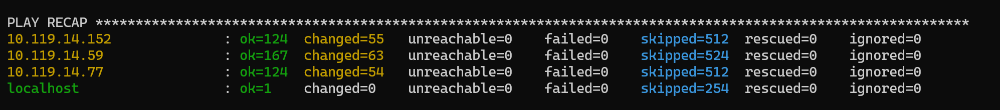
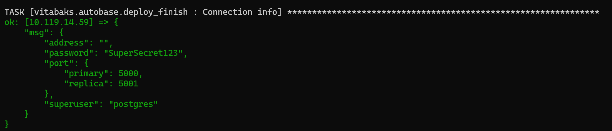
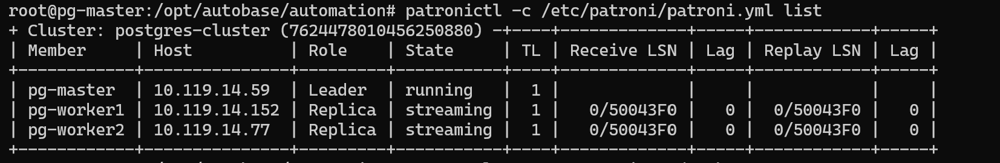
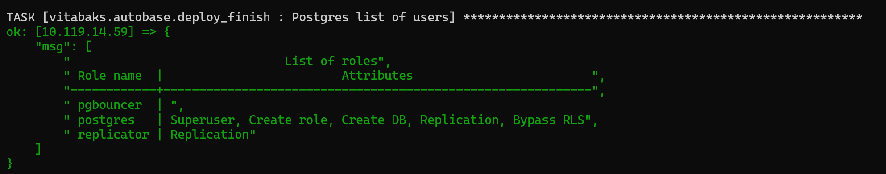
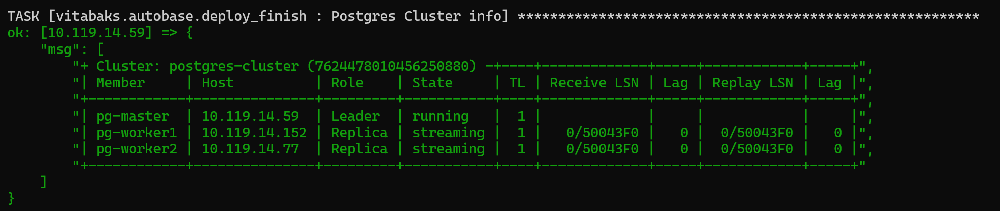

# PostgreSQL 3-Node HA Cluster Kurulumu

## Ortam Bilgileri

| Node | IP Adresi | Rol |
|------|-----------|-----|
| pg-master | 10.119.14.59 | Leader (Primary) |
| pg-worker1 | 10.119.14.152 | Replica |
| pg-worker2 | 10.119.14.77 | Replica |

> **Not:** 3 adet Ubuntu 24.04 LTS VirtualBox makine kullanılmıştır. Her node 2 CPU, 4 GB RAM, 25 GB disk ile yapılandırılmıştır.


---

## 1. SSH Key Kurulumu

Ansible'ın tüm node'lara şifresiz bağlanabilmesi için Master'dan SSH key üretilir ve diğer node'lara dağıtılır.

**Master node'da çalıştır:**

```bash
ssh-keygen -t ed25519 -f ~/.ssh/id_ed25519 -N ""
cat ~/.ssh/id_ed25519.pub
```

**Worker1 ve Worker2'de çalıştır:**

```bash
mkdir -p ~/.ssh && chmod 700 ~/.ssh
echo "SSH_PUBLIC_KEY" >> ~/.ssh/authorized_keys
chmod 600 ~/.ssh/authorized_keys
```

**Master'dan bağlantıyı doğrula:**

```bash
ssh -o StrictHostKeyChecking=no root@10.119.14.152 "hostname && echo OK"
ssh -o StrictHostKeyChecking=no root@10.119.14.77 "hostname && echo OK"
```

---

## 2. Hostname Yapılandırması

etcd cluster her node'u unique isimle tanımlar. Tüm node'lar "ubuntu" ismiyle geldiği için ayrı hostname atanması zorunludur.

**Master'dan tüm node'larda çalıştır:**

```bash
hostnamectl set-hostname pg-master
ssh root@10.119.14.152 "hostnamectl set-hostname pg-worker1"
ssh root@10.119.14.77 "hostnamectl set-hostname pg-worker2"
```

**/etc/hosts dosyasını güncelle (tüm node'larda):**

```bash
for host in 10.119.14.59 10.119.14.152 10.119.14.77; do
  ssh -o StrictHostKeyChecking=no root@$host "cat >> /etc/hosts << 'EOF'
10.119.14.59  pg-master
10.119.14.152 pg-worker1
10.119.14.77  pg-worker2
EOF"
done
```

---

## 3. Ansible Kurulumu

Ubuntu 24.04'ün varsayılan reposundaki Ansible versiyonu (2.16.x) Autobase için yetersizdir. **Minimum 2.17.0** gereklidir. PPA üzerinden güncel versiyon kurulur.

**Master node'da çalıştır:**

```bash
apt update && apt install -y software-properties-common git python3-pip
add-apt-repository --yes --update ppa:ansible/ansible
apt install -y ansible
ansible --version
```

`ansible [core 2.20.x]` görünmelidir.

---

## 4. Autobase Reposunu Clone'la

```bash
cd /opt
git clone --depth=1 https://github.com/autobase-tech/autobase.git
cd /opt/autobase/automation
```

**Ansible Galaxy collection'larını yükle:**

```bash
ansible-galaxy collection build --output-path /tmp/autobase-collection .
ansible-galaxy collection install /tmp/autobase-collection/vitabaks-autobase-*.tar.gz --force
ansible-galaxy install -r requirements.yml
```

---

## 5. Inventory ve Vars Dosyalarını Oluştur

**Inventory dosyası:**

```bash
mkdir /opt/autobase/automation/inventory
```

```bash
vim cat > /opt/autobase/automation/inventory/hosts.ini 
```

```yaml
[master]
10.119.14.59 ansible_user=root

[replica]
10.119.14.152 ansible_user=root
10.119.14.77 ansible_user=root

[postgres_cluster:children]
master
replica

[etcd_cluster:children]
postgres_cluster
```

**Vars dosyası:**

```bash
mkdir -p /opt/autobase/automation/vars
```

```bash
vim /opt/autobase/automation/vars/main.yml
```

```yaml
cluster_name: "postgres-cluster"
postgresql_version: 17
dcs_type: "etcd"
patroni_superuser_username: "postgres"
patroni_superuser_password: "SuperSecret123"
patroni_replication_username: "replicator"
patroni_replication_password: "ReplicatorSecret123"
with_haproxy_load_balancing: true
postgresql_password: "PostgresSecret123"
```


**Ansible ping testi:**

```bash
ansible all -i /opt/autobase/automation/inventory/hosts.ini -m ping
```

3 node'da da `pong` dönmelidir.

---

## 6. Cluster Deploy

```bash
cd /opt/autobase/automation
ansible-playbook playbooks/deploy_pgcluster.yml \
  -i inventory/hosts.ini \
  --extra-vars "@vars/main.yml"
```

> **Not:** Kurulum yaklaşık 20-30 dakika sürer. etcd, Patroni, PgBouncer, HAProxy ve Netdata otomatik olarak kurulur ve yapılandırılır.

---

## 7. Kurulum Sonuçları

### 7.1 PLAY RECAP — Tüm Node'lar Başarılı



`failed=0` tüm node'larda — kurulum hatasız tamamlanmıştır.

---

### 7.2 Cluster Bilgisi — Patroni Cluster Durumu



Playbook sonunda Patroni cluster durumu otomatik olarak raporlanır:

| Member | Host | Role | State | Lag |
|--------|------|------|-------|-----|
| pg-master | 10.119.14.59 | Leader | running | — |
| pg-worker1 | 10.119.14.152 | Replica | streaming | 0 |
| pg-worker2 | 10.119.14.77 | Replica | streaming | 0 |

`streaming` durumu ve `Lag: 0` replikasyonun gerçek zamanlı ve sağlıklı çalıştığını doğrular.

---

### 7.3 Bağlantı Bilgileri


| Parametre | Değer |
|-----------|-------|
| Superuser | postgres |
| Password | SuperSecret123 |
| Primary port (write) | 5000 |
| Replica port (readonly) | 5001 |

---

### 7.4 Veritabanı Listesi



Varsayılan olarak `postgres`, `template0` ve `template1` veritabanları oluşturulmuştur. 

---

### 7.5 Kullanıcı Listesi



---

### 7.6 Patronictl ile Cluster Durumu



```bash
patronictl -c /etc/patroni/patroni.yml list
```

---

## 8. Cluster Doğrulama Testleri

### 8.1 Servis Durumları

```bash
systemctl status patroni etcd pgbouncer --no-pager
```

Beklenen: 3 servis de `active (running)` olmalıdır.

### 8.2 etcd Cluster Sağlığı

```bash
etcdctl --cacert=/etc/patroni/tls/etcd/ca.crt \
        --cert=/etc/patroni/tls/etcd/server.crt \
        --key=/etc/patroni/tls/etcd/server.key \
        --endpoints=https://127.0.0.1:2379 \
        endpoint health
```

### 8.3 PostgreSQL Bağlantı Testi (PgBouncer üzerinden)

```bash
# Primary'e bağlan 
psql -h 10.119.14.59 -p 5000 -U postgres -c "SELECT pg_is_in_recovery();"


# Replica'ya bağlan
psql -h 10.119.14.59 -p 5001 -U postgres -c "SELECT pg_is_in_recovery();"

```

### 8.4 Replikasyon Durumu

```bash
psql -h 10.119.14.59 -p 5000 -U postgres -c "SELECT * FROM pg_stat_replication;"
```

2 satır dönmelidir — her replica için bir kayıt.

### 8.5 Failover Testi

```bash
# Patroni üzerinden manuel failover
patronictl -c /etc/patroni/patroni.yml failover postgres-cluster

# Yeni leader'ı kontrol et
patronictl -c /etc/patroni/patroni.yml list
```

---

## 9. Notlar

### Ansible Versiyon Gereksinimi
Autobase minimum **Ansible 2.17.0** gerektirir. Ubuntu 24.04 varsayılan reposunda 2.16.x gelmektedir. PPA üzerinden güncelleme yapılmalıdır.

### Bağlantı Noktaları

| Port | Servis | Açıklama |
|------|--------|----------|
| 5432 | PostgreSQL | Direkt PG bağlantısı |
| 5000 | HAProxy | Primary (yazma) |
| 5001 | HAProxy | Replica (okuma) |
| 6432 | PgBouncer | Connection pooling |
| 8008 | Patroni API | Health check |
| 2379 | etcd | Client |
| 2380 | etcd | Peer |


**Kullanılan teknolojiler:**
- **Patroni** — PostgreSQL HA orchestration
- **etcd** — Distributed configuration store (DCS)
- **PgBouncer** — Connection pooling
- **HAProxy** — Load balancing
- **Netdata** — Monitoring
